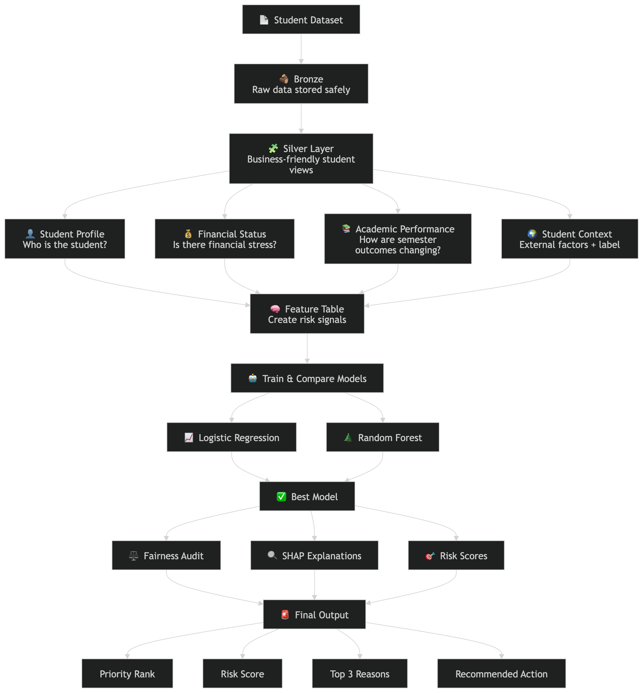
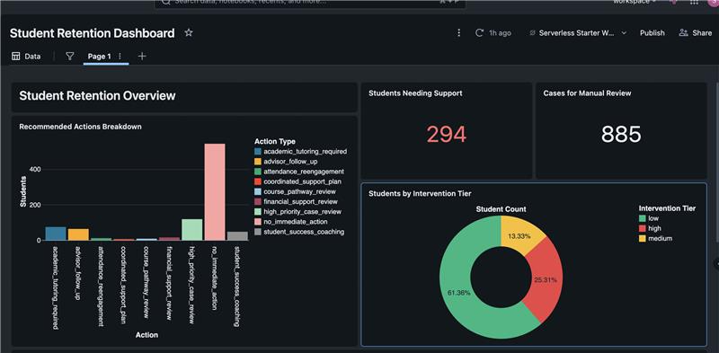
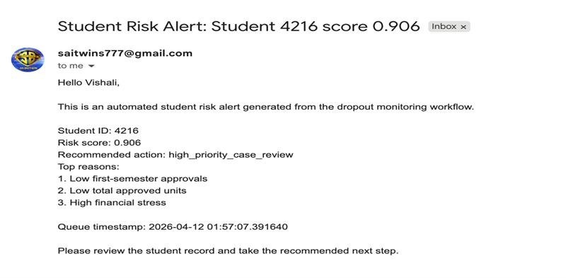
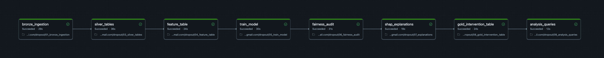

# 🎓 Student Dropout Risk Prediction System

<p align="center">
  
</p>

<p align="center">
  
  
  
</p>

<p align="center">
  <b>🏆 First Runner-Up at HackBricks 2026</b><br>
  End-to-End ML system for predicting student dropout risk and enabling proactive interventions
</p>

---

## 🚀 Why This Project Matters

Student dropout is not just a data problem — it's a **decision problem**.

Most institutions react *after* students disengage.
This system enables **proactive, explainable, and scalable intervention strategies** using modern data engineering + ML practices on Databricks.

---

## 🧠 What This System Does

✔ Predicts at-risk students
✔ Identifies *why* they are at risk
✔ Recommends targeted interventions
✔ Ensures fairness & bias monitoring
✔ Automates alerts + dashboards

---

## 🏗️ Architecture Overview

<p align="center">
  
</p>

### 🔄 Pipeline Flow

```text
Raw Student Data
   ↓
🥉 Bronze (Raw Ingestion)
   ↓
🥈 Silver (Cleaned Views)
   ↓
🧠 Feature Engineering
   ↓
🤖 ML Models (RF + LR)
   ↓
🔍 Explainability (SHAP)
   ↓
⚖️ Fairness Audit
   ↓
🎯 Gold Layer (Intervention Output)
   ↓
📊 Dashboards + Alerts
```

---

## ⚡ Key Highlights

### 🧩 End-to-End Data + ML Pipeline

* Medallion architecture (Bronze → Silver → Gold)
* Delta Lake + Spark processing
* Fully orchestrated workflow

### 🔍 Explainable AI (Not Black Box)

* SHAP-based explanations
* Top 3 risk drivers per student
* Transparent decision support

### ⚖️ Responsible AI

* Bias detection across demographics
* Fairness audits baked into pipeline

### 🎯 Action-Oriented Output

* Risk score (0–1)
* Intervention tier (Low/Medium/High)
* Recommended action per student

### 📡 Real-Time Observability

* Lakeview dashboards
* Automated email alerts
* Natural language analytics (Genie)

---

## 🛠️ Tech Stack

| Layer          | Technology                 |
| -------------- | -------------------------- |
| Platform       | Databricks (Unity Catalog) |
| Storage        | Delta Lake                 |
| Processing     | Apache Spark (PySpark)     |
| ML             | scikit-learn + MLflow      |
| Explainability | SHAP                       |
| Visualization  | Lakeview + Plotly          |
| Orchestration  | Databricks Workflows       |

---

## 📁 Project Structure

```text
HackBricks-databricks-usecase/
│
├── dropout-students-usecase-workflow/
│   ├── 00_shared_config.ipynb
│   ├── 01_bronze_ingestion.ipynb
│   ├── 02_silver_validation.ipynb
│   ├── 03_silver_tables.ipynb
│   ├── 04_feature_table.ipynb
│   ├── 05_train_model.ipynb
│   ├── 06_fairness_audit.ipynb
│   ├── 07_explanations.ipynb
│   ├── 08_gold_intervention_table.ipynb
│   ├── 09_analysis_queries.ipynb
│   ├── 10_email_alerts.ipynb
│   └── 99_full_pipeline_driver.ipynb
│
├── dashboards/
├── docs/   ← (All images here)
└── sample-scripts/
```

---

## 🔄 Workflow Deep Dive

### 🥉 Bronze Layer

* Raw ingestion into Delta tables
* Minimal transformation

### 🥈 Silver Layer

* Cleaned, business-ready datasets
* Domain modeling:

  * Student Profile
  * Financial Status
  * Academic Performance

### 🧠 Feature Engineering

* Academic trends
* Financial stress indicators
* Engagement signals

### 🤖 Model Training

* Logistic Regression
* Random Forest
* MLflow tracking

---

## 📊 Results & Insights

<p align="center">
  
</p>

### 📈 Key Metrics

* 🎯 294 high-risk students
* 📊 885 flagged for review
* ✅ 61% low-risk population
* ⚠️ 25% high-risk requiring intervention

---

## 🚨 Real-Time Alerting

<p align="center">
  
</p>

Each alert includes:

* Risk score
* Top contributing factors
* Recommended action

---

## 📡 Pipeline Monitoring

<p align="center">
  
</p>

✔ All pipeline stages automated
✔ Fully traceable and reproducible

---

## 📊 Model Performance

| Model               | AUC  | F1 Score | Precision | Recall |
| ------------------- | ---- | -------- | --------- | ------ |
| Random Forest       | 0.89 | 0.84     | 0.82      | 0.87   |
| Logistic Regression | 0.85 | 0.79     | 0.81      | 0.78   |

🏆 **Selected Model: Random Forest** (better recall for risk detection)

---

## 🚀 Getting Started

### Prerequisites

* Databricks Workspace
* DBR 14.3+
* Python 3.9+

### Run Full Pipeline

```python
%run ./99_full_pipeline_driver
```

---

## 🔮 Future Roadmap

* Real-time streaming ingestion
* Advanced models (XGBoost, LGBM)
* Time-series risk prediction
* A/B testing interventions
* LLM-based recommendation summaries

---

## 🙏 Acknowledgments

* HackBricks Team
* Databricks Community
* Contributors & Mentors

---

## 📬 Contact

* GitHub: https://github.com/SaiPurushoth
* LinkedIn: https://www.linkedin.com/in/sai-purushoth-0642871b7/

---

<p align="center">
  <b>Built with ❤️ on Databricks</b><br>
  🏆 HackBricks First Runner-Up
</p>
